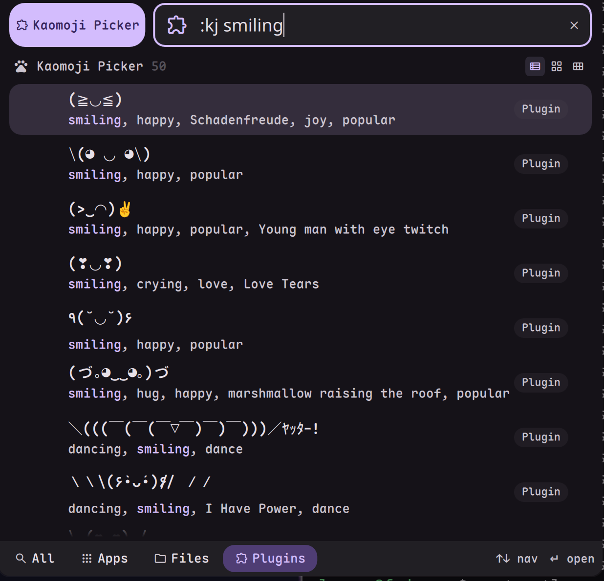

# DMS Kaomoji Picker



A local, native kaomoji picker plugin for [DankMaterialShell (DMS)](https://github.com/DankMaterialShell/DankMaterialShell). 
This plugin loads a comprehensive kaomoji database directly from a local JSON file and allows you to fuzzy-search and copy kaomoji to your clipboard natively using DMS's `launcher` interface.

## 🚀 Features

- **Blazing Fast**: Loads a local JSON database containing thousands of kaomoji.
- **Fuzzy Search**: Filter kaomoji by typing keywords like `happy`, `bear`, `flip`, or `angry`.
- **Native Clipboard**: Copies directly to the clipboard using `dms cl copy`.

## 📦 Installation

Link the project folder to your DMS plugins directory:

```bash
ln -s /path/to/dms-kaomoji-picker ~/.config/DankMaterialShell/plugins/kaomojiPicker
dms ipc plugins reload kaomojiPicker
```

Use `:kj` in the launcher to trigger the picker.

## 🛠️ Technical Note: The Empty Icon Trick

In DMS, if a launcher item's `icon` property is left empty (`""`), the launcher falls back to rendering the first character of the item's name. Since the kaomoji *is* the name (e.g., `(╯°□°）╯`), leaving the icon empty would result in a messy layout where the first character (like `(`) is extracted and displayed as the icon.

To achieve a clean, text-only layout without this fallback, we trick DMS by passing an invisible Braille Blank character (`U+2800`) via the `unicode:` prefix:
```javascript
icon: "unicode:\u2800"
```
This forces the UI to render the invisible character instead of attempting to extract the first letter of the Kaomoji.

## 💖 Credits

- Kaomoji database and core search logic ported from [noctalia-dev/noctalia-plugins](https://github.com/noctalia-dev/noctalia-plugins).
